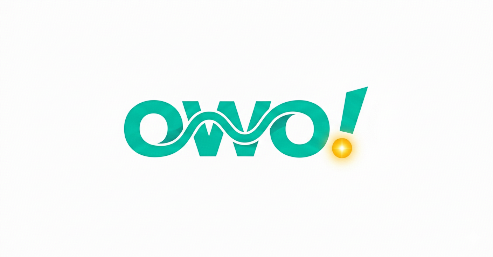
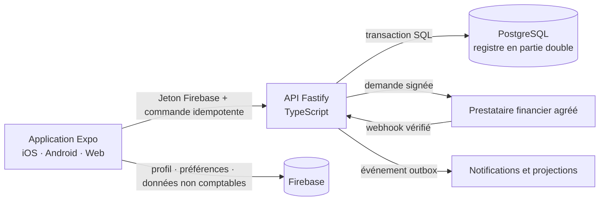

# owo! — La finance africaine, simplement



owo! est une plateforme de gestion financière pensée pour l’Afrique centrale et l’Afrique de l’Ouest. Elle réunit dans une seule expérience les comptes Mobile Money, les comptes bancaires, le budget, l’épargne, les paiements, une carte virtuelle et un coach financier intelligent.

Le Cameroun est le marché de lancement par défaut avec **Orange Money**, **MTN Mobile Money**, la devise **XAF** et l’indicatif **+237**. L’architecture prend également en charge une première couverture UEMOA en **XOF**.

> Le dépôt contient une application fonctionnelle en mode démonstration et une base transactionnelle exploitable. La circulation d’argent réel, l’émission de cartes et l’investissement nécessitent cependant des contrats avec des partenaires agréés, des identifiants de production et les validations réglementaires de chaque pays.

## Pourquoi owo! ?

Les finances d’un utilisateur africain sont souvent réparties entre plusieurs portefeuilles Mobile Money, une banque, des espèces, des cagnottes et parfois des comptes internationaux. Cette fragmentation rend difficile la réponse à des questions pourtant simples :

- combien puis-je réellement dépenser aujourd’hui ?
- quel opérateur contient mon argent ?
- est-ce que je respecte mon budget mensuel ?
- combien dois-je mettre de côté pour mon fonds d’urgence ?
- suis-je prêt à investir et auprès de quel intermédiaire réglementé ?

owo! construit une vue financière unifiée et transforme les mouvements enregistrés en informations directement exploitables.

## Fonctionnalités

| Domaine | Fonctionnalités disponibles |
| --- | --- |
| Tableau de bord | Solde consolidé, équivalent EUR, comptes Mobile Money, comptes bancaires, carte virtuelle, statistiques et opérations récentes |
| Mobile Money | Catalogue d’opérateurs par pays, connexion de compte simulée, synchronisation, déconnexion et affichage dans la devise locale |
| Paiements | Envoi, demande de paiement, dépôt, QR code, idempotence, suivi des statuts et mise à jour automatique des transactions |
| Coach owo! | Score de santé financière, budget par catégorie, capacité d’épargne, projection de fin de mois, fonds d’urgence et recommandations déterministes |
| Épargne | Objectifs individuels, épargne verrouillée, versements automatiques simulés, cagnottes collaboratives et suivi de progression |
| Investissement | Simulateur éducatif, explication des obligations, OPCVM et actions, parcours de préparation et liens vers les autorités régionales |
| Carte virtuelle | Interface Visa virtuelle, solde, limites journalières et mensuelles, gel instantané et historique d’achats simulé |
| Analyse | Revenus, dépenses, catégories, tendances, statistiques et suggestions budgétaires |
| Sécurité et compte | Firebase Authentication, Apple/Google Sign-In, biométrie prévue, suppression de compte, pages légales et assistance |
| Multiplateforme | iOS, Android et web grâce à Expo Router et React Native Web |

### Coach financier et intelligence intégrée

Le Coach owo! ne se contente pas de produire une conversation générique. Il calcule d’abord des indicateurs contrôlables à partir du profil financier :

- consommation du budget et dépassements par catégorie ;
- reste à dépenser et montant journalier prudent ;
- projection des dépenses à la fin du mois ;
- capacité et taux d’épargne ;
- poids des remboursements de dettes ;
- progression du fonds d’urgence ;
- niveau de préparation avant un investissement.

Les recommandations budgétaires principales sont déterministes et testables. Une couche conversationnelle peut ensuite expliquer ces résultats, sans modifier un solde ni exécuter un ordre financier de manière autonome.

### Investissement adapté à la région

L’écran d’investissement est actuellement éducatif : aucun ordre réel n’est transmis.

- en zone CEMAC, owo! présente la **BVMAC** et la **COSUMAF** ;
- en zone UEMOA, owo! présente la **BRVM** et l’**AMF-UMOA** ;
- l’utilisateur peut simuler un capital initial, des versements mensuels, une durée et une hypothèse de rendement ;
- l’application rappelle les risques de perte en capital et la nécessité de passer par un intermédiaire agréé.

## Couverture régionale initiale

owo! sépare toujours les deux francs CFA au niveau technique : **XAF** pour la CEMAC et **XOF** pour l’UEMOA.

| Pays | Zone | Devise | Opérateurs configurés |
| --- | --- | --- | --- |
| Cameroun | CEMAC | XAF | Orange Money, MTN Mobile Money |
| Bénin | UEMOA | XOF | MTN MoMo, Moov Money, Celtiis Cash |
| Côte d’Ivoire | UEMOA | XOF | Orange Money, MTN MoMo, Moov Money, Wave |
| Sénégal | UEMOA | XOF | Orange Money, Wave, Free Money |

Le pays actif est conservé sur l’appareil et synchronisé avec l’API lorsqu’elle est configurée. Un changement de zone crée le portefeuille XAF ou XOF manquant sans supprimer les anciens comptes ni leur historique comptable.

Voir [la documentation des marchés régionaux](docs/REGIONAL_MARKETS_FR.md) pour ajouter un pays ou un opérateur.

## Architecture



### Principe d’autorité

- **PostgreSQL** est l’autorité des soldes et des écritures financières.
- **Firebase Authentication** fournit l’identité de l’utilisateur.
- **Firestore** peut conserver les profils, préférences, projections et notifications non comptables.
- **Le mobile ne modifie jamais directement un solde en production.**
- **Les webhooks ne deviennent comptables qu’après vérification cryptographique et contrôle d’idempotence.**

### Flux d’un paiement instantané

1. Le mobile envoie une commande avec une clé d’idempotence.
2. L’API authentifie l’utilisateur, valide le montant, la devise et le compte source.
3. Un transfert interne est comptabilisé immédiatement dans une transaction SQL équilibrée.
4. Un transfert externe place d’abord une réservation sur le solde disponible.
5. Le prestataire traite la demande et renvoie un webhook signé.
6. L’API vérifie la signature, l’horodatage, l’unicité et la cohérence du webhook.
7. La réservation est capturée ou libérée, puis l’écriture en partie double est publiée.
8. L’application reçoit le nouveau statut et actualise l’interface.

Ce modèle évite les doubles débits, protège les fonds pendant un traitement externe et conserve une piste d’audit. Les détails sont documentés dans [INSTANT_PAYMENTS_FR.md](docs/INSTANT_PAYMENTS_FR.md).

## Technologies

### Mobile

- Expo SDK 57 et Expo Router ;
- React Native 0.86 et React 19 ;
- TypeScript 6 ;
- TanStack Query pour l’état serveur ;
- Firebase Authentication et Firestore ;
- React Native Reanimated, Gesture Handler et Lucide Icons ;
- EAS Build, EAS Submit et Expo Updates.

### API transactionnelle

- Node.js 20.19 ou supérieur ;
- Fastify 5 et TypeScript ;
- PostgreSQL avec écritures comptables en partie double ;
- Firebase Admin pour la vérification des jetons ;
- Zod pour la validation des entrées ;
- Vitest pour les tests métier et API ;
- outbox transactionnelle, réservations de solde et idempotence.

### Web et services historiques

- interface web React séparée dans `apps/web` ;
- fonctions Firebase historiques dans `functions`, progressivement remplacées pour les opérations financières par l’API transactionnelle.

## Structure du dépôt

```text
owo/
├── apps/
│   ├── mobile/       Application Expo iOS, Android et web
│   ├── api/          API transactionnelle Fastify/PostgreSQL
│   └── web/          Interface web complémentaire
├── functions/        Cloud Functions Firebase historiques
├── docs/             Architecture, paiements, sécurité et publication
├── assets/branding/  Identité visuelle partagée
├── firestore.rules   Règles de sécurité Firestore
└── storage.rules     Règles de sécurité Firebase Storage
```

## Prérequis

- Node.js `>= 20.19.0` ;
- npm ;
- PostgreSQL pour l’API ;
- un projet Firebase pour l’authentification ;
- Expo Go pour une vérification rapide ou un Development Build pour les modules natifs ;
- EAS CLI et des comptes développeur Apple/Google pour construire et soumettre les versions stores.

## Installation rapide

### 1. Cloner le dépôt

```bash
git clone https://github.com/flori92/owo.git
cd owo
```

### 2. Lancer l’application mobile

```bash
cd apps/mobile
npm ci
cp .env.example .env.local
npm run validate:config
npm start
```

Sous PowerShell, utilisez `Copy-Item .env.example .env.local` à la place de `cp`.

Commandes utiles :

```bash
npm run start:go     # Expo Go
npm run android      # build natif Android local
npm run ios          # build natif iOS, sur macOS uniquement
npm run web          # version web locale
```

Le mode de démonstration peut afficher l’interface sans infrastructure financière. Il ne doit jamais être activé dans un binaire de production.

### 3. Lancer PostgreSQL et l’API

Créez une base PostgreSQL, puis configurez l’API :

```bash
cd apps/api
npm ci
cp .env.example .env
npm run migrate
npm run dev
```

Variables principales :

| Variable | Rôle |
| --- | --- |
| `DATABASE_URL` | Connexion PostgreSQL |
| `DATABASE_SSL` | Active TLS pour la base distante |
| `FIREBASE_PROJECT_ID` | Projet utilisé pour vérifier les jetons Firebase |
| `CORS_ORIGINS` | Origines autorisées, séparées par des virgules |
| `TRUST_PROXY` | À activer uniquement derrière un proxy maîtrisé |

Dans le mobile, `EXPO_PUBLIC_API_URL` doit pointer vers cette API.

## Configuration mobile

Ne commitez jamais un fichier `.env.local` ou `.env.production` rempli.

Les paramètres requis pour une release comprennent :

- les variables publiques de configuration Firebase ;
- `EXPO_PUBLIC_API_URL` en HTTPS ;
- les URL de politique de confidentialité, conditions, support et suppression de compte ;
- une adresse d’assistance réelle ;
- `EXPO_PUBLIC_AUTH_BYPASS=false` ;
- `EXPO_PUBLIC_ENABLE_DEMO_MIGRATION=false` ;
- `EXPO_PUBLIC_APP_MODE=production`.

Le validateur de release bloque les configurations incomplètes ou dangereuses.

## API principale

| Méthode | Route | Usage |
| --- | --- | --- |
| `GET` | `/health/live` | Disponibilité du processus |
| `GET` | `/health/ready` | Disponibilité de PostgreSQL |
| `GET` | `/v1/markets` | Catalogue des marchés régionaux |
| `GET` | `/v1/me` | Synchronisation et profil API |
| `PATCH` | `/v1/me/market` | Changement de pays, zone et devise |
| `GET` | `/v1/accounts` | Comptes et soldes disponibles |
| `GET/POST` | `/v1/payment-intents` | Consultation ou création d’une intention de paiement |
| `GET/PUT` | `/v1/financial-coach/profile` | Lecture ou mise à jour du profil budgétaire |
| `POST` | `/v1/financial-coach/analyze` | Analyse financière déterministe |
| `POST` | `/v1/financial-coach/chat` | Explication conversationnelle de l’analyse |
| `POST` | `/v1/account-deletion-requests` | Demande de suppression du compte |

Toutes les routes métier sont authentifiées. La création d’un paiement requiert également l’en-tête `Idempotency-Key`.

## Qualité et vérifications

### Mobile

```bash
cd apps/mobile
npm run typecheck
npm test
npm run validate:config
npx expo-doctor
```

### API

```bash
cd apps/api
npm run check
```

`npm run check` exécute le typage, les tests et la compilation de l’API.

### Contrôle avant publication

```bash
cd apps/mobile
npm run release:check
```

Cette commande vérifie notamment les identifiants natifs, Firebase, les pages légales, le support, l’API HTTPS et la désactivation des raccourcis de démonstration.

## Construction iOS et Android

Le projet utilise EAS Build et EAS Submit :

```bash
cd apps/mobile
npm run build:preview
npm run build:production
npm run submit:production
```

Avant toute soumission :

1. exécuter `npm run release:check` ;
2. tester un build réel sur iPhone et Android ;
3. vérifier connexion, suppression de compte, caméra, notifications et reprise réseau ;
4. fournir les captures, textes stores, politique de confidentialité et coordonnées de support ;
5. utiliser d’abord TestFlight et une piste de test fermée Google Play ;
6. obtenir les validations juridiques, KYC/AML et partenaires nécessaires avant d’activer des fonds réels.

Consultez [BUILD_GUIDE.md](apps/mobile/BUILD_GUIDE.md) et la [checklist de publication](docs/STORE_RELEASE_CHECKLIST.md).

## Sécurité financière

Les garanties déjà intégrées dans l’architecture comprennent :

- authentification obligatoire des routes métier ;
- validation stricte des données entrantes ;
- montants stockés en unités monétaires entières ;
- séparation explicite XAF/XOF ;
- écritures débit/crédit équilibrées ;
- verrouillage des comptes pendant les traitements sensibles ;
- clés d’idempotence contre les doubles soumissions ;
- réservations pour empêcher la double dépense ;
- références prestataire uniques ;
- journal outbox pour les effets asynchrones ;
- limitation de débit, en-têtes de sécurité et CORS contrôlé ;
- suppression de compte traçable.

À compléter avant une production financière réelle : gestionnaire de secrets, rotation des clés, signatures webhook propres à chaque prestataire, KYC/AML, lutte antifraude, limites réglementaires, rapprochement quotidien, supervision, plan de réponse aux incidents et audits indépendants.

## État du produit

### Fonctionnel aujourd’hui

- navigation et interface mobile Expo SDK 57 ;
- mode démonstration complet ;
- catalogue Cameroun/CEMAC/UEMOA ;
- dashboard, budgets, objectifs, cagnottes et carte virtuelle simulée ;
- Coach owo! déterministe ;
- simulateur d’investissement éducatif ;
- API authentifiée, comptes, intentions de paiement et registre comptable ;
- builds EAS configurés pour iOS et Android.

### Nécessite encore un partenaire ou une mise en production

- lecture réelle des soldes Orange Money et MTN MoMo ;
- dépôts et retraits réels ;
- webhooks signés propres aux prestataires sélectionnés ;
- émission et traitement d’une carte Visa/Mastercard réelle ;
- KYC, AML, scoring antifraude et limites réglementaires ;
- passage d’ordres sur la BVMAC ou la BRVM ;
- infrastructure de production, observabilité et assistance opérationnelle 24/7.

## Documentation

- [Architecture produit](docs/PRODUCT_ARCHITECTURE_FR.md)
- [Paiements instantanés](docs/INSTANT_PAYMENTS_FR.md)
- [Coach financier](docs/FINANCIAL_COACH_FR.md)
- [Marchés CEMAC/UEMOA](docs/REGIONAL_MARKETS_FR.md)
- [Migration Expo SDK 57](docs/EXPO_SDK_57_MIGRATION_FR.md)
- [Checklist App Store et Play Store](docs/STORE_RELEASE_CHECKLIST.md)
- [Guide de construction EAS](apps/mobile/BUILD_GUIDE.md)

## Contribution

Toute évolution touchant aux soldes, paiements ou devises doit préserver les invariants comptables, inclure des tests et documenter le scénario d’échec. N’ajoutez jamais un opérateur réel au flux transactionnel uniquement parce qu’il apparaît dans l’interface : son connecteur doit être contractuellement autorisé, testé et vérifié côté serveur.

## Avertissement

owo! est en phase de développement. Les données affichées en mode démonstration sont fictives. Les analyses budgétaires et simulations d’investissement sont éducatives et ne constituent ni une promesse de rendement ni un conseil en investissement personnalisé.
