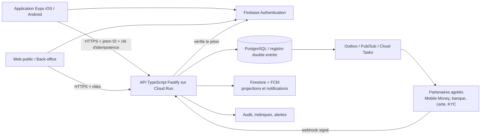

# owo! — produit, architecture cible et feuille de route

Date de l'analyse : 22 juillet 2026

## 1. Positionnement recommandé

owo! doit être présenté comme un **hub financier mobile pour l'Afrique francophone** : une seule application pour visualiser ses comptes, initier des paiements, gérer une épargne individuelle ou collective et recevoir des alertes utiles. Le premier marché doit rester limité à un pays et à une devise — par exemple le Cameroun en XAF — tant que les partenaires, licences et procédures opérationnelles n'ont pas été validés.

Le produit ne doit pas prétendre conserver ou transférer des fonds avant la contractualisation d'un établissement agréé. Le code fournit le canal mobile et le registre technique ; un partenaire de paiement ou une licence adaptée reste nécessaire pour manipuler de l'argent réel.

### Utilisateurs prioritaires

1. Un particulier qui utilise plusieurs services Mobile Money et veut une vue claire de son argent.
2. Un utilisateur qui envoie régulièrement de l'argent à sa famille.
3. Un groupe ou une association qui organise une épargne commune avec des règles transparentes.
4. À terme, un petit commerçant qui encaisse par QR et suit ses règlements.

## 2. Fonctionnalités présentes dans le dépôt

| Domaine | Fonctionnalités observées | Niveau actuel |
|---|---|---|
| Accès | inscription, connexion email, Google, Apple, récupération de mot de passe, écrans 2FA | socle présent, fournisseurs à configurer et tester sur appareils |
| Tableau de bord | synthèse des portefeuilles, activité récente, statistiques | fonctionnel avec Firestore/données de démonstration |
| Portefeuilles | portefeuille principal, comptes Mobile Money et bancaires, affichage des soldes | interface présente ; connexions prestataires non finalisées |
| Transactions | envoi, réception, dépôt, historique et détails | demandes désormais routées par l'API ; règlement réel à connecter |
| QR | lecture de QR code et parcours de paiement | interface présente ; contrat marchand à finaliser |
| Épargne | objectifs, épargne bloquée, groupes/tontines | écrans riches, logique encore largement locale ou simulée |
| Cartes | carte virtuelle, recharge et activité | interface/démonstration ; émetteur de carte indispensable |
| Notifications | liste, lecture, événements Firestore | socle présent ; push et préférences à compléter |
| Compte | profil, support, mentions légales, demande de suppression | parcours présent ; pages légales et processus opérationnel requis |
| Livraison | Expo/EAS, profils preview/production, validation release, CI mobile | prêt à produire des binaires après ajout des secrets et comptes stores |

## 3. Choix technologiques

### Décision

Il n'est pas pertinent de réécrire l'application en Flutter, Swift ou Kotlin. Expo/React Native permet de conserver une base iOS/Android commune, la nouvelle architecture React Native est la voie standard actuelle, et EAS sait construire et soumettre les deux binaires. Une réécriture retarderait le produit sans résoudre les vrais risques, qui se trouvent dans le traitement serveur, la conformité et les intégrations financières.

La cible retenue est :

- **Mobile : Expo + React Native + TypeScript**, avec migration progressive des fichiers JSX restants ;
- **État distant : TanStack Query**, état d'interface local avec Zustand uniquement lorsque nécessaire ;
- **Identité : Firebase Authentication**, puis jeton ID vérifié par l'API ;
- **API : Node.js 22 + TypeScript + Fastify**, sous forme de monolithe modulaire ;
- **Argent : PostgreSQL/Cloud SQL**, montants entiers et registre immuable en double entrée ;
- **Temps réel secondaire : Firestore/FCM** pour profils, notifications et projections, jamais comme autorité du solde ;
- **Exécution : Cloud Run**, secrets dans Secret Manager et pool PostgreSQL borné ;
- **Asynchrone : outbox PostgreSQL puis Pub/Sub ou Cloud Tasks** pour prestataires, notifications et rapprochement ;
- **Observabilité : logs structurés sans données personnelles, métriques OpenTelemetry, alertes et suivi d'erreurs** ;
- **Administration : application web séparée avec rôles, MFA obligatoire et journal d'audit**.

Fastify est retenu plutôt que NestJS pour garder un service petit, rapide et explicite. Le découpage modulaire laisse la possibilité de passer à NestJS si l'équipe devient importante. Go ne devient utile que pour un futur service de règlement à très fort volume ; l'introduire aujourd'hui multiplierait inutilement les compétences à maintenir.

### Pourquoi un monolithe modulaire

Les domaines `identity`, `accounts`, `payments`, `ledger`, `savings`, `notifications`, `compliance` et `support` restent séparés dans le code et partagent une transaction PostgreSQL. C'est plus sûr et plus simple à opérer qu'un ensemble de microservices prématurés. Un module ne sera extrait que lorsqu'il aura un besoin de montée en charge, de sécurité ou de cycle de déploiement réellement différent.

## 4. Architecture cible

### Propriété des données

| Donnée | Source d'autorité | Règle |
|---|---|---|
| identité et session | Firebase Authentication | le mobile transmet un jeton, l'API en vérifie signature et révocation |
| solde et mouvements | PostgreSQL ledger | somme des écritures postées ; jamais une valeur envoyée par le téléphone |
| demande de paiement | PostgreSQL payment intent | clé d'idempotence obligatoire et statut piloté par le serveur |
| profil et préférences | API/PostgreSQL, projection Firestore possible | données modifiables et auditables |
| notifications | Firestore/FCM | projection reconstruisible, pas une donnée financière primaire |
| événements prestataire | outbox + journal webhook | signature, horodatage, anti-rejeu et conservation |

### Cycle d'un paiement

1. Le téléphone obtient un jeton Firebase et envoie une demande avec une clé d'idempotence.
2. L'API valide l'utilisateur, le compte, le montant, la devise, les limites et le risque.
3. Elle crée un `payment_intent` à l'état `pending` et un événement d'outbox dans la même transaction.
4. Un worker appelle le prestataire agréé. Un succès d'appel ne signifie pas encore que l'argent est réglé.
5. Le webhook signé du prestataire est vérifié et dédupliqué.
6. L'API inscrit au minimum un débit et un crédit équilibrés, puis passe la demande à `completed`.
7. Une projection met à jour l'interface et une notification est envoyée.

Le fast path interne ne dépend pas d'un webhook : si le bénéficiaire est un compte owo! vérifié, le débit et le crédit sont postés avant la réponse HTTP. Pour un rail externe, les fonds sont réservés immédiatement et la réponse synchrone du prestataire peut finaliser l'opération ; le webhook reste la confirmation idempotente et le filet de rapprochement. Les budgets et états sont détaillés dans `INSTANT_PAYMENTS_FR.md`.

## 5. Sécurité et fiabilité obligatoires

- Utiliser uniquement des montants entiers (`amount_minor`) ; aucun calcul financier en nombre flottant.
- Refuser toute écriture comptable postée qui n'est pas équilibrée par devise.
- Ne jamais modifier ou supprimer une écriture : une correction est une transaction d'annulation liée à l'originale.
- Exiger une clé d'idempotence pour chaque commande financière et dédupliquer aussi les webhooks.
- Vérifier signature, timestamp et fenêtre anti-rejeu de chaque prestataire.
- Chiffrer les secrets avec Secret Manager et les données personnelles sensibles au repos ; masquer téléphone, email et jetons dans les logs.
- Séparer rôles client, support, conformité, finance et administrateur ; MFA obligatoire pour le back-office.
- Ajouter limites journalières, vélocité, listes de sanctions, détection d'appareil et revue manuelle selon le niveau KYC.
- Réconcilier chaque jour registre interne, rapports prestataires et comptes bancaires ; aucune différence ne doit être ignorée.
- Définir sauvegardes, restauration testée, RPO/RTO et procédure d'incident avant le lancement public.

## 6. Feuille de route produit proposée

### Phase 0 — pilote contrôlé

- Limiter le lancement à un pays, XAF, un partenaire Mobile Money et un petit groupe d'utilisateurs.
- Finaliser inscription, KYC, appareil de confiance, code PIN/biométrie et récupération de compte.
- Connecter un prestataire sandbox puis production avec webhooks et rapprochement.
- Construire le back-office minimum : recherche client, KYC, blocage, limites, revue de transaction, remboursement et export audit.
- Finaliser CGU, confidentialité, tarification, support, suppression de compte et délais de traitement.
- Mesurer taux de succès, latence, abandon KYC, erreurs prestataires et tickets support.

### Phase 1 — proposition de valeur centrale

- Envoi entre utilisateurs owo! instantané et demandes d'argent par lien/QR.
- Dépôt et retrait Mobile Money avec suivi clair des frais avant confirmation.
- Historique unifié, reçus partageables, recherche et export PDF/CSV.
- Budgets simples, catégories automatiques et alertes de solde.
- Épargne par objectif avec ordres programmés ; aucune promesse de rendement sans cadre légal.

### Phase 2 — croissance

- Tontines numériques avec règles, votes, calendrier, pénalités transparentes et double validation.
- Paiement de factures et recharges téléphoniques.
- QR marchand, application ou portail commerçant et règlements quotidiens.
- Carte virtuelle via un émetteur agréé, contrôle des plafonds et gel immédiat.
- Comptes famille, argent de poche et contrôles parentaux.

### Phase 3 — expansion

- Multi-pays et multi-devises après séparation des entités, règles et partenaires par juridiction.
- Transferts internationaux, change et tarification dynamique sous licence adaptée.
- API partenaires avec OAuth, scopes, quotas, signatures et portail développeur.
- Conseils personnalisés explicables, avec consentement et sans décisions de crédit opaques.

## 7. Améliorations UX proposées

- Remplacer « Ajouter transaction » par des actions explicites : `Envoyer`, `Déposer`, `Retirer`, `Demander`.
- Toujours afficher frais, taux, bénéficiaire, délai et montant reçu sur un écran de confirmation.
- Distinguer visuellement `en attente`, `en traitement`, `réussi`, `échoué`, `annulé` et permettre une action adaptée.
- Afficher un reçu contenant référence owo!, référence prestataire et canal de support, sans exposer de données sensibles.
- Prévoir un mode réseau instable : reprise sûre, aucune double soumission, état local `à synchroniser`.
- Rendre l'application accessible : tailles dynamiques, contraste, lecteurs d'écran, zones tactiles et langue simple.
- Ajouter français et anglais au pilote, puis langues locales selon les retours terrain.

## 8. Ce qui a été implémenté dans cette refonte

- API Fastify TypeScript conteneurisée et compatible Cloud Run.
- Vérification des jetons Firebase côté serveur et révocation contrôlée.
- PostgreSQL avec utilisateurs, comptes, demandes idempotentes, registre débit/crédit, soldes calculés, outbox et suppressions de compte.
- Contrainte différée qui refuse une transaction comptable postée non équilibrée.
- Le mobile de production appelle l'API ; il ne crée plus de transaction Firestore.
- L'ancien client Neon embarqué et ses composants inutilisés ont été supprimés.
- Les règles Firestore refusent maintenant toute création de transaction par un client.
- CI indépendante pour l'API : types, tests, build et construction du conteneur.
- Tests unitaires sur l'équilibre du registre, les unités monétaires, la santé et l'authentification de l'API.
- Fast path owo!→owo!, réservations de fonds externes, statut sans cache et rafraîchissement mobile adaptatif.

## 9. Travail externe restant avant une mise en ligne réelle

Le dépôt ne peut pas inventer les éléments suivants : compte Apple Developer, compte Google Play, identifiants EAS, projet Firebase de production, instance PostgreSQL, domaine, pages légales publiées, compte de support, contrats prestataires, procédures KYC/AML, assurance et autorisations réglementaires. Le validateur de release bloque volontairement un binaire de production tant que ces valeurs sont absentes ou factices.

Une première publication peut être faite comme **outil de suivi financier sans mouvement de fonds**, à condition que le marketing, les écrans et les mentions légales reflètent exactement cette limite. L'activation des paiements doit faire l'objet d'une release séparée après audit de sécurité, test de charge, rapprochement et validation juridique.

## 10. Références techniques officielles

- [Expo EAS Build et soumission](https://docs.expo.dev/build/)
- [Gestion des versions Expo](https://docs.expo.dev/build-reference/app-versions/)
- [Nouvelle architecture React Native](https://reactnative.dev/architecture/landing-page)
- [Vérification des jetons Firebase](https://firebase.google.com/docs/auth/admin/verify-id-tokens)
- [Fastify TypeScript](https://fastify.dev/docs/latest/Reference/TypeScript/)
- [Triggers de contrainte PostgreSQL](https://www.postgresql.org/docs/current/trigger-definition.html)
- [Contrat des conteneurs Cloud Run](https://docs.cloud.google.com/run/docs/container-contract)
- [Connexion Cloud Run à Cloud SQL PostgreSQL](https://docs.cloud.google.com/sql/docs/postgres/connect-run)
